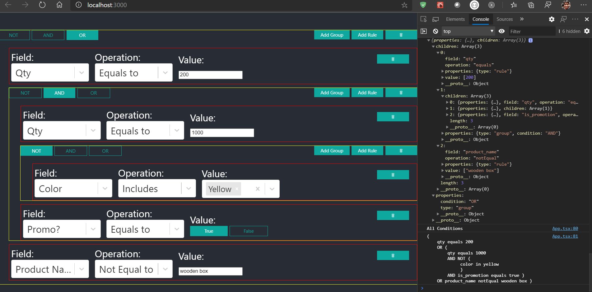

This project was bootstrapped with [Create React App](https://github.com/facebook/create-react-app).

Rule Editor for handling following cases:
- [How to use](#how-to-use)
- [Functionalities](#functionalities)
  - [Group and Rules](#group-and-rules)
  - [Sample Output](#sample-output)
- [Pending features](#pending-features)
- [Bugs](#bugs)
  - [Components](#components)
    - [Field Interface](#field-interface)
- [Available Scripts](#available-scripts)
  - [`yarn start`](#yarn-start)
  - [`yarn test`](#yarn-test)
  - [`yarn build`](#yarn-build)

## How to use
+ Update fields for filter in ```module/FieldConfig.ts```
+ Update basic rule in ```App.tsx```

## Functionalities

### Group and Rules
Each group can have:
  + Another Group or Rule
  + condition: AND | OR | NOT

Each Rule can have:

  + field: One of the field from ```FieldConfig.ts```
  + operation: ```"equals" | "notEqual"| "lessThan" | "greaterThan" | "lessThanEqual" | "greaterThanEqual" | "between" | "in"``` 
  + value: Array of value

### Sample Output
Check ```output/assignment-output.png```


 
## Pending features
+ Mobile View
+ Service calls for storing and updating rule

## Bugs
For some reason the children are not updated immediately when you click on "Add Group" or "Add Rule" | "Delete" buttons

**Workaround is:**  ```After clicking or updating, change the condition of main group to trigger re-render ```

### Components
  + field: Dropdown
  + operation: Dropdown
  + value:
    + SingleValue
      + Text
      + Number
      + Boolean
    + when ```operation === "BETWEEN"```
      + 2 Numeric Input field
    + when ```operation === "IN"```
      + select dropdown with ```listValues``` from fieldSettings if available
      + Else input box [provide value separated by ","]

#### Field Interface
```
type FieldComponentType = "input" | "select" | "multiselect" | "slider";

export type FieldValueType = "text" | "number" | "boolean";

export interface IField {
    label: string;
    value: string;
    componentType: FieldComponentType;
    valueType: FieldValueType;
    fieldSettings?: {
        /**
         * A function that returns true if current selected value is Valid for field
         */
        validate?:(value: any)=> boolean;
        errorMsg?: string;
        /** Min max for numeric field */
        min?: number;
        max?: number;
    };
    /**
     * Specific set of allowed operations
     */
    operators?: OperationType[];
    /**
     * Set of allowed values for Dropdown
     */
    listValues?: {label: string; value: string;}[]
}
```

## Available Scripts

In the project directory, you can run:

### `yarn start`

Runs the app in the development mode.<br />
Open [http://localhost:3000](http://localhost:3000) to view it in the browser.

The page will reload if you make edits.<br />
You will also see any lint errors in the console.

### `yarn test`

Launches the test runner in the interactive watch mode.<br />
See the section about [running tests](https://facebook.github.io/create-react-app/docs/running-tests) for more information.

### `yarn build`

Builds the app for production to the `build` folder.<br />
It correctly bundles React in production mode and optimizes the build for the best performance.

The build is minified and the filenames include the hashes.<br />
Your app is ready to be deployed!

See the section about [deployment](https://facebook.github.io/create-react-app/docs/deployment) for more information.